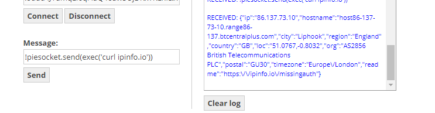

# WebSocket Reverse Shell Controller

This repository contains a WebSocket Reverse Shell Controller, a simple yet effective tool allowing users to control a reverse shell via WebSocket. This tool is built with HTML and JavaScript, providing a user-friendly interface to interact with the shell.

## ⚠️ Warning

This tool is for educational and research purposes only. Unauthorized access to computer systems is illegal and punishable by law. The developer(s) of this tool are not responsible for any misuse or damage that may occur.

## 🚀 Setup & Usage

### Step 1: Clone the Repository
```sh
git clone https://github.com/ezydubs/WebSocket-CnC-Controller.git
```

### Step 2: Open `index.html`
Navigate to the cloned directory and open `index.html` with your preferred web browser.

### Step 3: Enter WebSocket URL
Enter the WebSocket URL of the reverse shell in the input bar. This is usually in the format:
```
ws://hostname:port
```

### Step 4: Click Send
Click the "Send" button to initiate the connection to the reverse shell.



## 🖥️ Interface

The interface consists of a simple input bar to enter the WebSocket URL and a "Send" button to initiate the connection. Once connected, you can interact with the shell directly via the provided terminal interface.

## 🛠️ Customization

You can modify the HTML, CSS, and JavaScript files to customize the appearance and functionality of the tool according to your needs.

## 📜 License

This project is licensed under the MIT License - see the [LICENSE.md](LICENSE.md) file for details.

## 🙏 Acknowledgments

- All contributors to this project.
- Everyone who finds this tool useful for educational and research purposes.

---

Feel free to fork, modify, and contribute to this project. If you encounter any issues or have any feature requests, please open an issue or submit a pull request.

Remember to replace the placeholder URL in the clone command with the actual URL of your repository, and feel free to modify any part of this README to better fit your project's needs.
